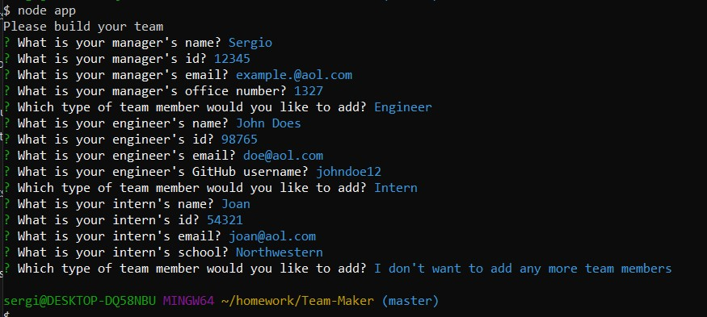
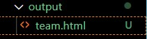
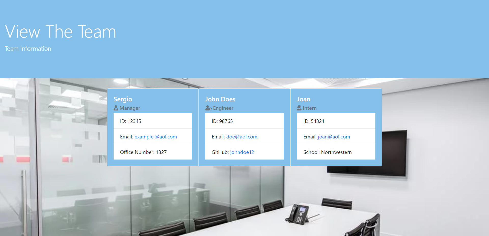

# Team-Generator

Generates a team for your company, putting in the details of each of the employees. You start by installing the dependecies which is inquirer and using node on the terminal you being to set up the team. Once you area all complete then you put stop adding. Upon doing that a file will open up called, "output" inside will be the new html that you can do so that you are able to view the team online. 

The app will run by typing in "node app.js" on your terminal and will prompt you into entering the information of 
each employee:

Once you enter the information a new folder will appear called "output"  inside will be a file named "team.html" like this:

Open that file in your web browser and you should need your new Team website!

